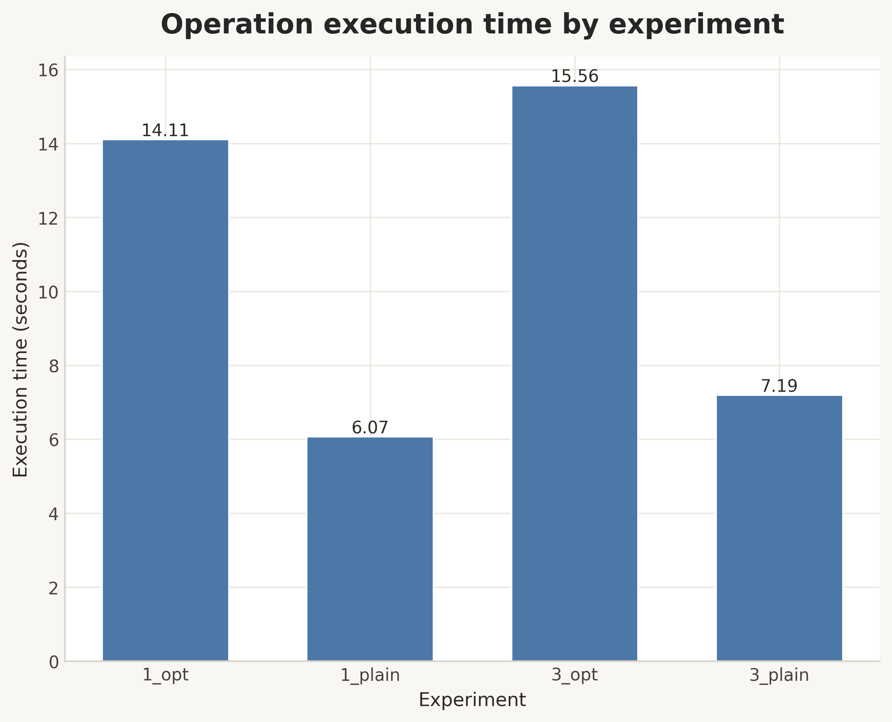
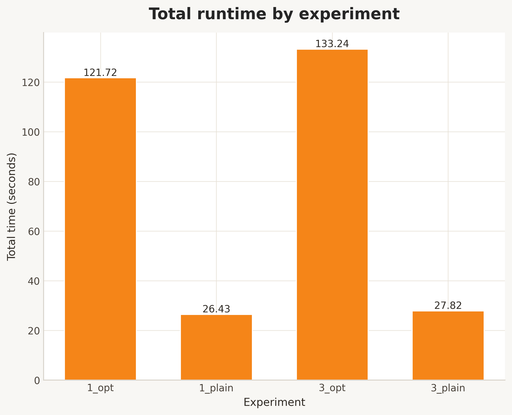
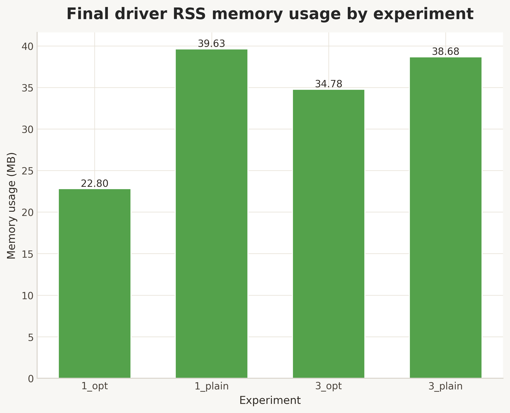
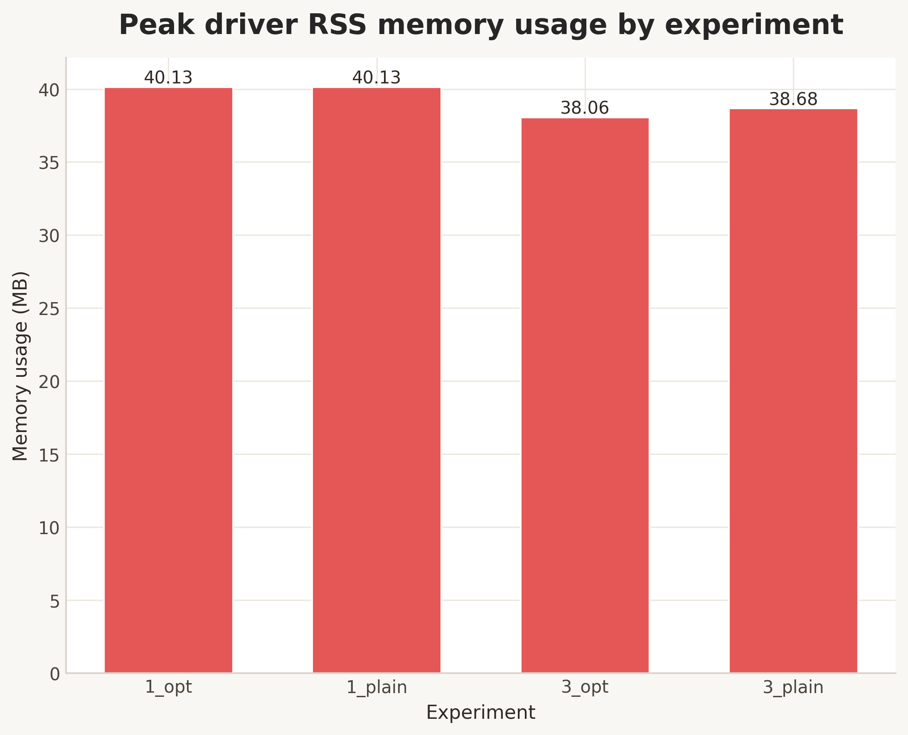
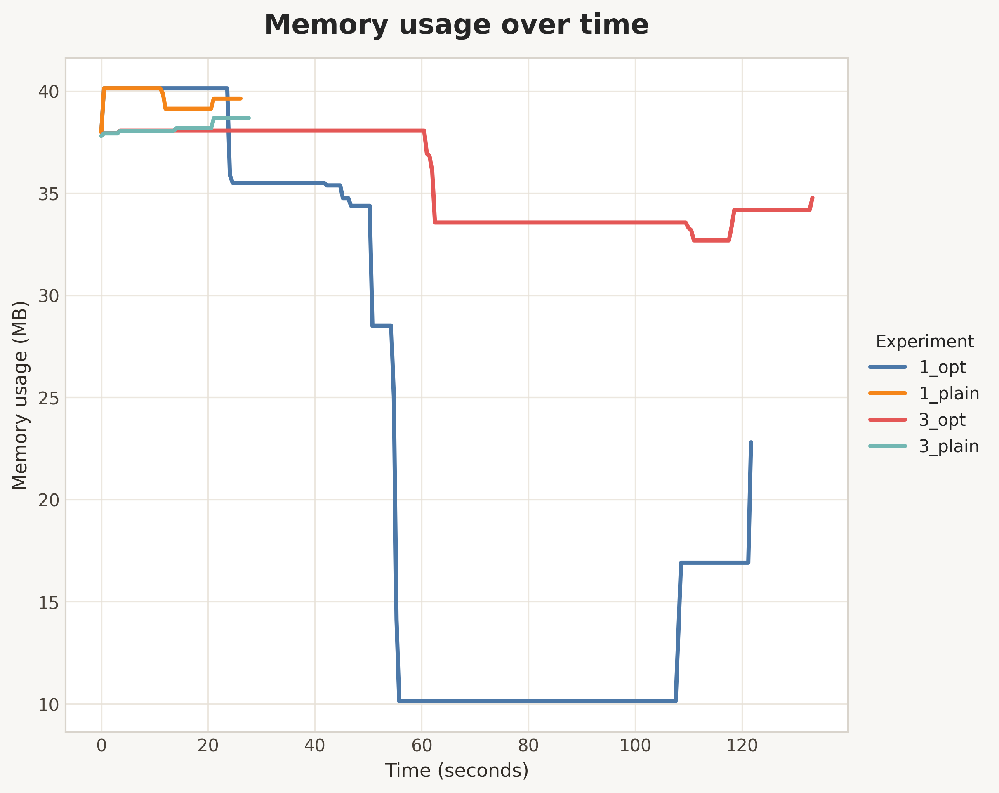
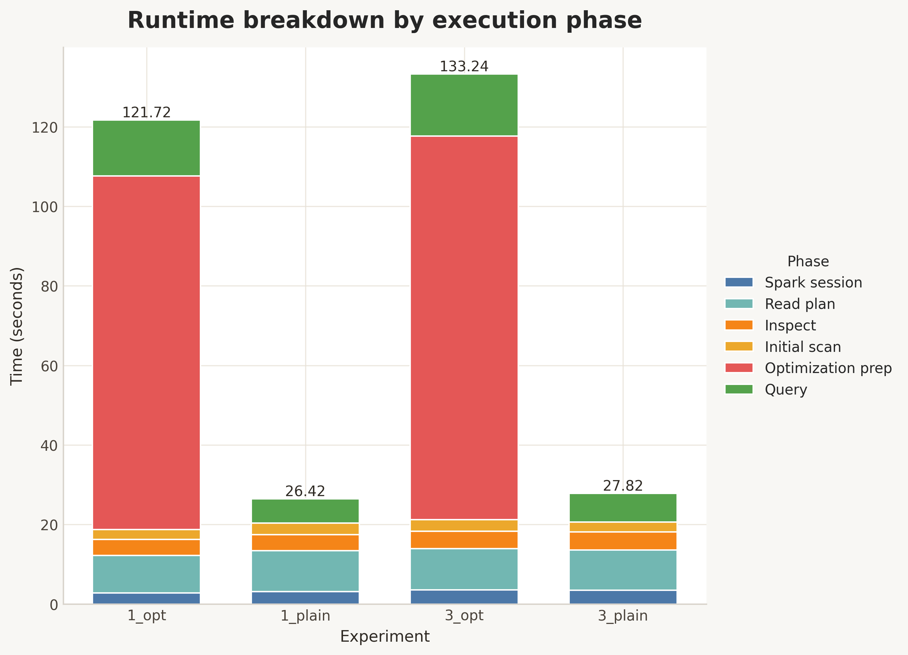
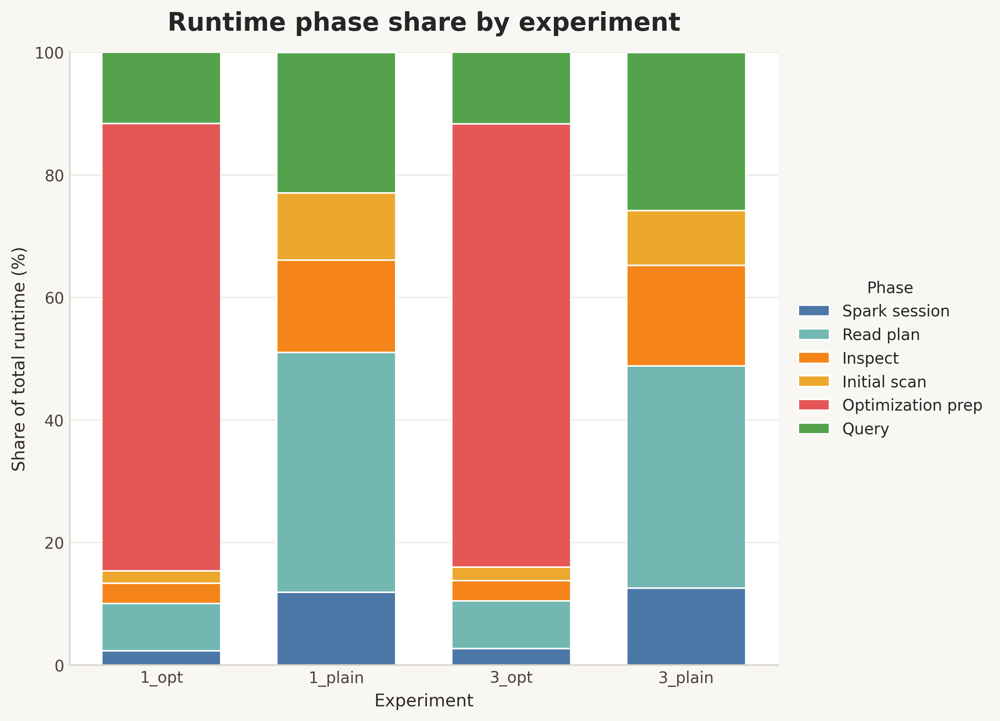

# Hadoop + Spark Taxi Benchmark

This is a small course project where the same Spark job is run under a few different configurations and then compared by time and memory usage.

The main comparisons are:

- `plain` vs `opt`
- `1` DataNode vs `3` DataNodes

The dataset comes from `iampalina/nyc_taxi`. It is downloaded locally as Parquet, uploaded to HDFS, and then used as the input for a simple Spark aggregation job.

## What's in the project

- [docker-compose.yml](/Users/artyomtugaryov/Development/repositories/dear/lab-2-hadoop/docker-compose.yml) starts the HDFS and Spark services
- [app/main.py](/Users/artyomtugaryov/Development/repositories/dear/lab-2-hadoop/app/main.py) runs the Spark job and saves benchmark metrics
- [scripts/experiment.sh](/Users/artyomtugaryov/Development/repositories/dear/lab-2-hadoop/scripts/experiment.sh) runs the full experiment set
- [tools/download_dataset.py](/Users/artyomtugaryov/Development/repositories/dear/lab-2-hadoop/tools/download_dataset.py) downloads the dataset
- [tools/plot_charts.py](/Users/artyomtugaryov/Development/repositories/dear/lab-2-hadoop/tools/plot_charts.py) builds charts from the JSON results
- `data/results/` stores benchmark JSON files
- `data/results/charts/` stores generated chart images

## Setup overview

The `docker-compose` setup includes:

- `namenode`
- `datanode`
- `spark`
- `spark-worker`
- `spark-app`

One important detail: there is only one Spark worker in this setup. The experiments change the number of HDFS DataNodes, not the number of Spark workers. So moving from `1` to `3` DataNodes changes storage topology and HDFS behavior, but it does not add Spark compute capacity.

## What the Spark job does

The job in [app/main.py](/Users/artyomtugaryov/Development/repositories/dear/lab-2-hadoop/app/main.py) does the following:

1. Creates a `SparkSession`
2. Reads the Parquet dataset from HDFS
3. Prints the schema and a few sample rows
4. Runs an initial `count()`
5. In `opt` mode, also runs:
   - `repartition(4)`
   - `cache()`
   - a cache warm-up `count()`
6. Builds the final aggregation

For this taxi dataset, the main path is:

- group by `passenger_count`
- compute `trip_count`
- compute `avg_fare_amount`
- compute `max_fare_amount`

If those columns are missing, the code falls back to other available columns.

## What gets measured

Each run writes a JSON entry with benchmark metrics. The main fields are:

- `ops_time`: compatibility alias for `query_time`
- `query_time`: time spent on the main analytical query
- `spark_session_time`: time spent creating the `SparkSession`
- `read_time`: time spent building the Parquet read plan
- `inspection_time`: time spent on `printSchema()` and `show()`
- `initial_scan_time`: time spent on the first full `count()`
- `optimization_time`: time spent on `repartition`, `cache`, and cache warm-up
- `total_time`: full runtime from benchmark start to final result collection
- `final_memory_usage`: last sampled RSS of the Python driver process
- `peak_memory_usage`: highest sampled RSS of the Python driver process
- `memory_usage_over_time`: time series used for the memory chart

Important note: the memory metrics describe only the Python driver process. They are not the full Spark application memory footprint, because JVM and executor memory are not included.

## Dataset

- source: <https://huggingface.co/datasets/iampalina/nyc_taxi>
- format: Parquet
- local file used by this project: `data/dataset.parquet`

The dataset includes columns such as `fare_amount`, `pickup_datetime`, `pickup_longitude`, `pickup_latitude`, `dropoff_longitude`, `dropoff_latitude`, and `passenger_count`.

## Requirements

- Docker
- Docker Compose
- internet access for downloading the dataset and building the Python image

Host-side Python dependencies are listed in [requiremetns.txt](/Users/artyomtugaryov/Development/repositories/dear/lab-2-hadoop/requiremetns.txt):

```bash
python3 -m pip install -r requiremetns.txt
```

These are only needed for downloading the dataset and generating charts.

## Quick start

### 1. Download the dataset

```bash
python3 tools/download_dataset.py
```

By default, it is saved as `data/dataset.parquet`.

### 2. Start the cluster

```bash
docker compose up -d
```

Useful UIs:

- HDFS NameNode: <http://localhost:9870>
- Spark Master: <http://localhost:8080>

### 3. Run all experiments

```bash
bash scripts/experiment.sh
```

The script will:

1. start the cluster with `1` DataNode
2. upload the dataset to HDFS
3. run `1_plain` and `1_opt`
4. save results to `data/results/results_1.json`
5. restart the cluster with `3` DataNodes
6. run `3_plain` and `3_opt`
7. save results to `data/results/results_3.json`
8. rebuild charts in `data/results/charts`

### 4. Rebuild charts manually

This is usually not necessary, because `scripts/experiment.sh` already does it.

```bash
python3 tools/plot_charts.py
```

You can also override the paths:

```bash
python3 tools/plot_charts.py --input-dir data/results --output-dir data/results/charts
```

## Running the Spark job manually

The `spark-app` container stays alive with `sleep infinity`, so the job can also be run manually:

```bash
docker compose exec spark-app /spark/bin/spark-submit \
  --master spark://spark:7077 \
  /opt/spark-app/main.py \
  --experiment-key manual_run \
  --dataset-path hdfs://namenode:9000/user/hadoop/dataset.parquet \
  --spark-master spark://spark:7077
```

## Charts

These charts are generated from the JSON files in `data/results`.

### The main two

`ops_time.png` shows only the analytical part of the workload. `total_time.png` shows the full run. In practice, these are usually the first two charts worth checking.

#### `ops_time.png`



#### `total_time.png`



### Memory charts

`final_memory_usage.png` shows the last sampled RSS value for the Python driver. `peak_memory_usage.png` shows the highest sampled value. `memory_usage_series.png` is useful when the shape over time matters more than the final number.

#### `final_memory_usage.png`



#### `peak_memory_usage.png`



#### `memory_usage_series.png`



### Runtime breakdown charts

These are helpful when the question is not just "which one is slower?" but "where exactly is the extra time going?"

#### `runtime_breakdown.png`

This chart shows absolute time by phase: Spark startup, read planning, inspection, initial scan, optimization preparation, and query execution.



#### `runtime_phase_share.png`

This chart shows the same phases, but normalized as percentages of the total runtime.



## How to interpret the results

With the current benchmark logic, `opt` is not guaranteed to be faster. In this project it does extra work:

- `repartition(4)`
- `cache()`
- a separate cache warm-up pass

If only one analytical query is executed after that, the preparation cost may not pay for itself. So seeing `opt` slower than `plain` is not surprising here.

Also, going from `1` to `3` DataNodes does not add Spark workers, so there is no reason to expect a compute speedup from CPU parallelism alone.

## Current results

The most reliable numbers are the ones stored in the JSON files under `data/results`, because they change whenever the benchmark is rerun.

At the time this README was last updated, the project contained these values:

| Experiment | Ops time, s | Total time, s | Final memory, MB |
|---|---:|---:|---:|
| `1_plain` | 34.85 | 83.01 | 38.69 |
| `1_opt` | 81.16 | 350.01 | 17.65 |
| `3_plain` | 58.61 | 111.57 | 36.90 |
| `3_opt` | 93.61 | 627.23 | 31.75 |

If this table disagrees with the charts or JSON files, it just means the experiments were rerun and the README was not updated yet.

## Practical takeaways

- for the current job, `plain` looks more useful than `opt`
- increasing the number of HDFS DataNodes alone does not improve Spark compute performance
- if the goal is actual speedup, scaling Spark workers or executor resources makes more sense
- memory conclusions should not be based only on `final_memory_usage`; `peak_memory_usage` and the full series matter too

## Possible next steps

- add more Spark workers and rerun the benchmark
- measure JVM and executor memory, not only driver RSS
- try different `repartition` values
- run more than one analytical query so `cache()` has a real chance to help
- generate the README results table automatically from the JSON files

## Small note

The dependency file in the repository root is called `requiremetns.txt`. The name is unusual, but that is the file currently used by the project.
